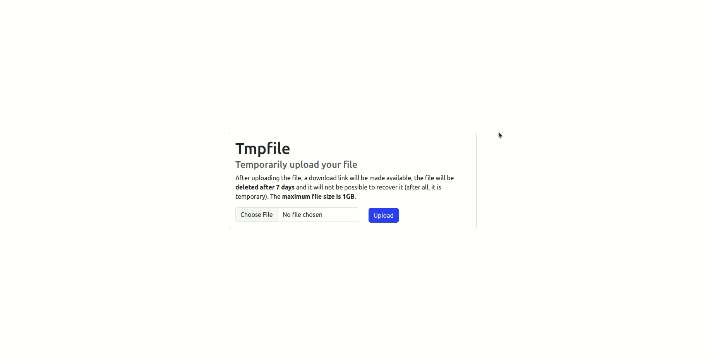

# 📂 Tmpfile

Tmpfile is a web application that stores temporary files and provides a download link to sharing the file with
anyone else who has access to the link

## 📝 Features

- [x] Stores text files, installers, zipped files, images, videos and much more!
- [x] Generates a download link for the sent file

## 👾 Demo



## ❓ How to use

### ✋ Prerequisites

Before starting, you will need to have the following tools installed on your machine:
[Git](https://git-scm.com), [JDK 17](https://openjdk.org/projects/jdk/17/),
[Maven](https://maven.apache.org/), [Postgres](https://www.postgresql.org/),
[Docker and Docker Compose](https://docs.docker.com/). 

### 🚀 Running

```bash
# Clone this repository
git clone https://github.com/alvesluis0/tmpfile

# Access the project folder in terminal/cmd
cd tmpfile

# Run dependency containers
docker compose up -d

# Install the application
mvn package

# Run the application
java -jar target/tmpfile.jar

# The server will start on port:8080 - access <http://localhost:8080> to test
```

## 🪄 How it works

The project was developed using the
[clean architecture](https://betterprogramming.pub/the-clean-architecture-beginners-guide-e4b7058c1165)
methodology, with the use of Docker containers for simpler dependency management. The front-end was built using
Bootstrap, and the back-end was implemented using Spring Boot

* As demonstrated, the user uploads a file through the input, and the _JavaScript_ sends a **POST** request to
the **/upload route**, submitting the file
* The back-end receives the file, stores it in the _files_ folder, and saves its information in
_PostgreSQL_
* Subsequently, a randomly generated string of 6 characters, which serves as the file ID, is returned
* Accessing the **/upload/{id}** route initiates the download of the file with the specified ID
* The project's _Scheduler_ cleans up files saved for more than 7 days daily, recycling memory and creating space
for new files

## 🛠 Technologies

The following tools were used to build the project:

- [Java 17](https://openjdk.org/projects/jdk/17/)
- [Maven](https://maven.apache.org/)
- [Postgres](https://www.postgresql.org/)
- [Spring Boot](https://spring.io/)
- [Docker and Docker Compose](https://docs.docker.com/)
- [Bootstrap](https://getbootstrap.com/)

## 🔖 Learnings

- Container orchestration with Docker Compose
- Reading, writing, removing and downloading files
- Schedule tasks
- Creating simple pages with Bootstrap